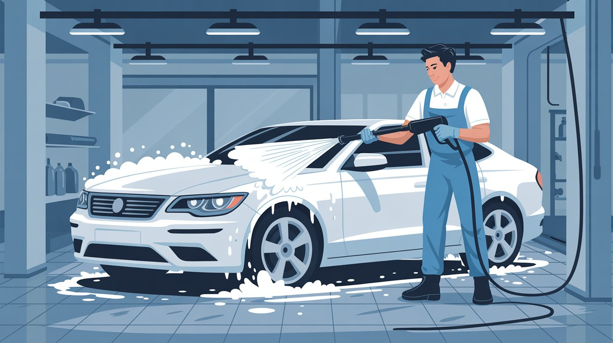
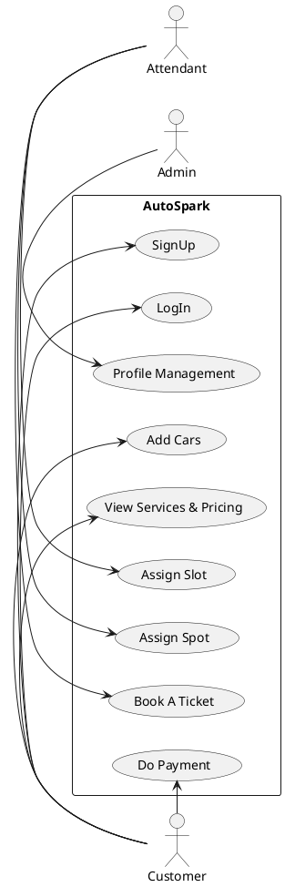
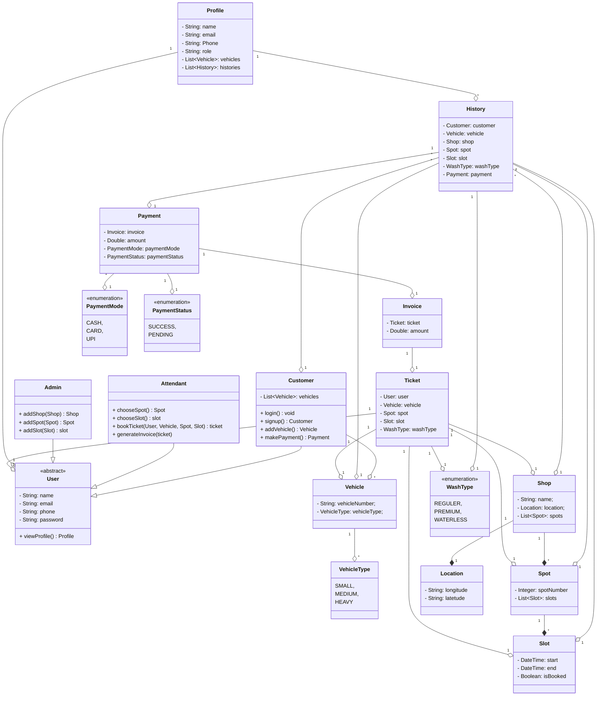

# AutoSpark

A pure car washing service

## Feature
- User can SignUp/LogIn
- View Profile
- Add cars
- View Service and pricing
- Add or remove slot
- Add or remove spot
- Assign Spot
- Assign Slot
- Book a ticket
- Do Payment

## UML Diagram

## Entities & Attributes
- User
  - name
  - email
  - vehiclesList
  - userType
- Vehicle
  - vehicleNumber
  - vehicleType
- Shop
  - Name
  - location
  - spots
- Spot
  - SpotNumber
  - slotList
- Slot
  - Start
  - End
  - isBooked
- Ticket
  - user
  - vehicle
  - Spot
  - Slot
  - WashType
- Location
  - longitude
  - latitude
- Invoice
  - ticket
  - amount
- Payment
  - invoice
  - amount
  - paymentMode

## Class Diagram

